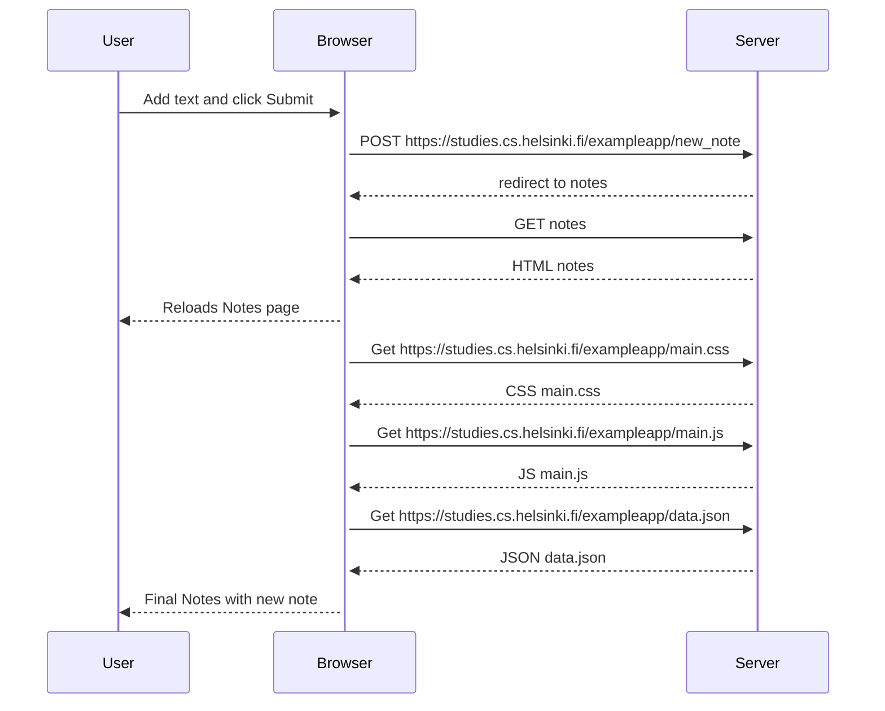

```mermaid
sequenceDiagram
    User->>+Browser: Add text and click Submit
    Browser->>+Server: POST https://studies.cs.helsinki.fi/exampleapp/new_note
    Server-->>Browser: redirect to notes

    Browser->>+Server: GET notes
    Server-->>Browser: HTML notes

    Browser-->>User: Reloads Notes page

    Browser->>+Server: Get https://studies.cs.helsinki.fi/exampleapp/main.css
    Server-->>Browser: CSS main.css

    Browser->>+Server: Get https://studies.cs.helsinki.fi/exampleapp/main.js
    Server-->>Browser: JS main.js

    Browser->>+Server: Get https://studies.cs.helsinki.fi/exampleapp/data.json
    Server-->>Browser: JSON data.json
    
    Browser-->>User: Final Notes with new note
```